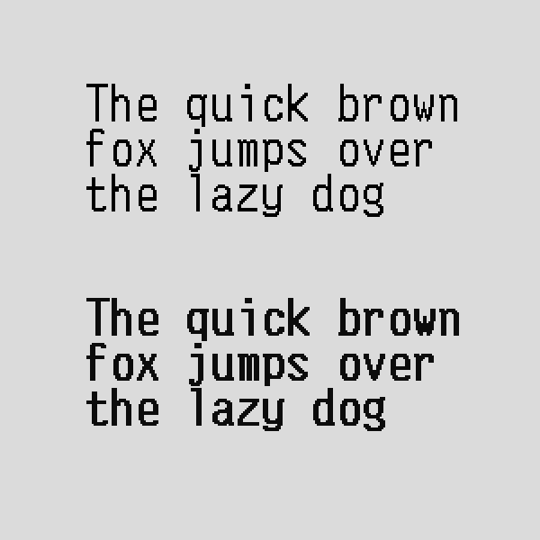

# VKP80II embedded font
Font from thermal printer Custom VKP80II. All symbols only from code page 437 and only size 14x24px converted to ttf and use UTF-8. 

## All symbols
Regular same as in printer

Bold
generated from regular in the same way as printer do

## Usage
Best result without antialising. Best size is a multiply of 24.

## Remark
Additional symbols for CP437 codepage øØ□¤§¨ no symbol from 0x00 to 0x1F and φ⌂

Printer resolution 8 pixels in millimeter. Size from baseline to top 21 pixel. Regular capital symbol size should be 2.625mm. 

## Example

